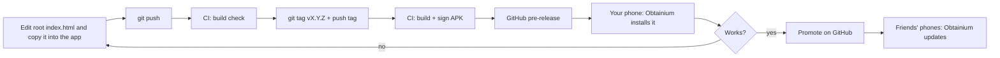

# Peak Mild Effort — Android app: build, release and update plan

Written 25/09/2026, then updated the same day to match the app that was actually built. The computer this was written on has no Android tools, so do all of this on a computer with **Android Studio**. This document calls that computer the **build computer**.

The Android app already exists and works. It is in `html-to-app-android/` on `main`, from commits `b5ae032` ("Add working Android WebView app project") and `60fd27f` ("Small mobile UI polish"). This plan **keeps that app exactly as built** and adds only what's needed to release and update it. It includes the full text of every file to add or change, so the build computer only needs this file and an up-to-date clone of the repository.

---

## 0. Read this first

### 0.1 What you will end up with

- The existing Android app **Peak Mild Effort** (package `com.example.peakmildeffort`, Android 7.0 or newer). It shows a bundled copy of the repo-root `index.html`, works fully offline, and keeps its data on the phone.
- A **release pipeline**. You push a version tag to GitHub and GitHub Actions builds and signs the app file (APK). It then publishes the APK as a **pre-release** on the repository's Releases page.
- **Automatic updates** on every phone through **Obtainium**, a free app that installs and updates apps straight from GitHub Releases. Your phone gets pre-releases for testing. Friends' phones only get releases you have promoted.

### 0.2 How an update travels (after setup)



### 0.3 The four things that must NEVER change after the first install

> [!IMPORTANT]
> Android only installs an update over the existing app, keeping its data, if every one of these stays exactly the same forever.

| # | What | Value | What breaks if it changes |
|---|------|-------|---------------------------|
| 1 | Package name (applicationId) | `com.example.peakmildeffort`, set in `app/build.gradle.kts` | Android treats it as a different app. No update path, and the old data stays behind in the old app. |
| 2 | Release signing key | The keystore you create in Part 9 | Android refuses the update ("App not installed"). People would have to uninstall, which deletes their data. |
| 3 | The in-app page address (origin) | `https://appassets.androidplatform.net/assets/index.html`, set in `MainActivity.kt` | Saved data is tied to the address, so the app would look empty. |
| 4 | localStorage key in `index.html` | `peak-mild-effort.v1` | The app would look empty. |

Also:
- The **version tag** must always go up (`v1.0.0` → `v1.0.1` → `v1.1.0` …). Android refuses to install an older version over a newer one.
- **Never uninstall** the app to "fix" an update. Uninstalling deletes the log. The only planned exception is a one-time move off a test copy built on the build computer, done with a backup (Part 10.2).

### 0.4 Who does what

- **[AI]** steps can be done by an AI coding assistant on the build computer (Parts 3–8).
- **[YOU]** steps must be done by you: anything involving passwords, signing keys, GitHub settings, pushing tags, or your phone (Parts 9–13).
- Never paste passwords, keystore contents or GitHub secrets into an AI chat.

### 0.5 Copy-paste prompt for the AI on the build computer

```text
Read Android-Release-Plan.md in this repository and implement Parts 3 to 8 in order.
Rules:
- The Android app in html-to-app-android/ already works. Do not rewrite, restructure or "improve"
  it. Make only the changes listed in Part 3, using the exact file contents given in the plan.
- Only deviate if a build error forces it. In that case make the smallest possible fix and tell me
  exactly what you changed and why.
- Never change the four "must never change" values in Part 0.3.
- Do not edit index.html. The only allowed index.html action is copying the root file over the
  app's copy so the two stay identical (Part 4).
- Never create, read or ask for signing keys, keystore files or passwords. Part 9 is mine.
- After each Part, run its "Check" steps and report honestly what passed, what failed and what you
  could not test. Do not claim phone tests you did not run; ask me to run them.
- Do not push, tag, merge or delete anything on GitHub without asking me first.
```

### 0.6 Progress checklist

- [ ] Part 1 — Build computer ready
- [ ] Part 2 — Repo up to date, branch `release-pipeline` created
- [ ] Part 3 — Release settings added to the existing app (nothing else in the app changed)
- [ ] Part 4 — Both `index.html` copies confirmed identical
- [ ] Part 5 — Debug build ("Peak (debug)") installed on your phone, phone checklist passed
- [ ] Part 6 — GitHub Actions workflows added
- [ ] Part 7 — READMEs updated
- [ ] Part 8 — Pushed, "Android build check" green, merged to `main`
- [ ] Part 9 — Keystore created and backed up, GitHub secrets and variable set, 2FA on
- [ ] Part 10 — Data moved off any test copy, `v1.0.0` pre-release installed, update test `v1.0.1` passed, `v1.0.1` promoted
- [ ] Part 13 — Package name registered for developer verification (do this **before** Part 11; see 13.1)
- [ ] Part 11 — Friends onboarded

---

## 1. Prerequisites on the build computer [YOU]

1. **Android Studio** Quail 2 or newer, the version the app was built with. It must support Android Gradle Plugin (AGP) **9.3.3**. The build computer that created the app already meets this. If Gradle sync on another computer says the AGP version is too new, update Android Studio (Help → Check for Updates).
2. **Git**. On Windows, install "Git for Windows" if `git --version` doesn't work in a terminal.
3. **A phone** running Android 7.0 or newer, plus a USB cable, for testing debug builds (optional but strongly recommended). To install from Android Studio over USB, turn on Developer options and USB debugging on the phone.
4. **Your GitHub account** (`GrassTree-Muzz`), with two-factor sign-in turned on (Part 9.5). The repository must stay **public**, because Obtainium reads public releases without a token.
5. **A password manager**, to store the signing key and its password in Part 9.

---

## 2. Get the code up to date [YOU or AI]

The build computer already has the clone the app was pushed from. PowerShell, inside that clone:

```powershell
git checkout main
git pull
git checkout -b release-pipeline
```

On any other computer, clone first:

```powershell
cd $HOME
git clone https://github.com/GrassTree-Muzz/FitnessTracking.git
cd FitnessTracking
git config user.name "GrassTree-Muzz"
git config user.email "81797977+GrassTree-Muzz@users.noreply.github.com"
git checkout -b release-pipeline
```

The existing commits use that GitHub "noreply" address, so no real email address appears in the public history. Keep using it.

Make sure this document (`Android-Release-Plan.md`) is at the repo root. If you brought it over by USB or email, copy it there.

**Check:**
- `git status` shows branch `release-pipeline`.
- `git log --oneline -2` shows `60fd27f Small mobile UI polish`, or something newer.
- `html-to-app-android/app/src/main/java/com/example/peakmildeffort/MainActivity.kt` exists.

---

## 3. Add release settings to the existing app [AI]

### 3.1 What already exists (keep it)

The build session created and tested this app. Every file was read on 25/09/2026 at commit `60fd27f`, and the app already meets this plan's requirements. **Do not recreate, restructure or "upgrade" any of it.**

| File in `html-to-app-android/` | What it contains |
|---|---|
| `settings.gradle.kts` | Project `PeakMildEffort` with one module, `:app`. Repositories: Google and Maven Central. |
| `build.gradle.kts` | AGP **9.3.3**. |
| `gradlew`, `gradlew.bat`, `gradle/wrapper/*` | Gradle **9.5.1**, with a `distributionSha256Sum` so a tampered download is refused. `gradlew` is already marked executable in Git. |
| `gradle.properties` | Gradle's memory setting only. |
| `.gitignore`, `.gitattributes` | Ignore build output, `local.properties`, `*.jks` and `*.keystore`. Keep `gradlew` with Linux line endings for CI. |
| `app/build.gradle.kts` | Package `com.example.peakmildeffort`, compileSdk 37, targetSdk 36, minSdk 24 (Android 7.0+), Java 11. Libraries: activity 1.13.0, appcompat 1.8.0, core 1.19.1, webkit 1.17.1. A fixed `versionCode = 1` and no signing. **Part 3.3 changes this file.** |
| `app/src/main/AndroidManifest.xml` | One launcher activity. **No permissions at all, not even internet.** No custom icon, so the phone shows Android's default app icon. |
| `app/src/main/java/com/example/peakmildeffort/MainActivity.kt` | The WebView shell (see the next table). |
| `app/src/main/res/values/` | `strings.xml` (app name "Peak Mild Effort"), `colors.xml` (`paper` `#F5F7F4`, matching the page) and `themes.xml` (AppCompat light theme, no action bar). |
| `app/src/main/assets/index.html` | An identical copy of the repo-root `index.html` (Part 4). |

What `MainActivity.kt` does:

| Feature | How |
|---|---|
| Loads the page offline | `WebViewAssetLoader` serves the bundled `index.html` at `https://appassets.androidplatform.net/assets/index.html`. That is a fixed, secure address handled entirely inside the app, not a website. |
| Keeps your data | JavaScript and DOM storage (`localStorage`) are on, and the address never changes. |
| Links | Only the app's own address loads inside the app. Other `https` links, such as the Unsplash credit, open in the phone's browser; anything else is blocked. File access is off. |
| Download backup | The page sends the backup text to the **`AndroidBackup`** bridge. Android opens a "save as" screen suggesting `peak-mild-effort-YYYY-MM-DD.json`, writes the file, then shows "Backup saved" or "Backup could not be saved". |
| Bridge security | The bridge uses `addWebMessageListener`, restricted to the origin `https://appassets.androidplatform.net` and to the main frame. No other page can reach it, and all it can do is offer to save a file that you confirm. |
| Old WebView | If the phone's Android System WebView is too old for the bridge, Download backup says "Backup not saved. Update Android System WebView from Google Play, then try again." |
| Restore a backup | The page's file input opens the Android document picker, which shows all file types. Cancelling does nothing. |
| Browser dialogs | A `WebChromeClient` is installed, so `window.prompt` (Paste sync code) and `alert` messages work. |
| Back button | Goes back inside the page when possible, otherwise leaves the app. |
| Screen edges and keyboard | The page is padded clear of the status bar, navigation bar, camera cutout and keyboard. The status bar icons stay dark to suit the light page. |

### 3.2 What this plan adds or changes (nothing else)

```text
FitnessTracking/
├── .gitignore                                  (new, 3.5)
├── .github/workflows/android-build.yml         (new, Part 6)
├── .github/workflows/android-release.yml       (new, Part 6)
├── Android-Release-Plan.md                     (this file)
├── README.md                                   (changed, Part 7)
├── index.html                                  (master copy of the page; not edited)
└── html-to-app-android/
    ├── README.md                               (one section changed, Part 7)
    └── app/
        ├── build.gradle.kts                    (changed, 3.3)
        └── src/
            ├── debug/res/values/strings.xml    (new, 3.4)
            └── main/assets/index.html          (must equal the root index.html, Part 4)
```

Everything else stays byte-for-byte as the build session left it, including `MainActivity.kt`, the manifest, the resources and the AGP and Gradle versions. `Android-WebView-Guide.txt` stays too, because the app's README links to its checks.

### 3.3 Replace `html-to-app-android/app/build.gradle.kts`

This is the build session's file with three additions: version numbers from the Git tag, release signing from environment variables, and a separate debug package. Every value the build session chose is kept.

```kotlin
plugins {
    id("com.android.application")
}

// Versions come from the Git tag: CI passes -PreleaseVersion=1.2.3 for tag v1.2.3.
val releaseVersion = providers.gradleProperty("releaseVersion").getOrElse("0.0.1")
val versionNumbers = Regex("""(\d+)\.(\d{1,2})\.(\d{1,2})""").matchEntire(releaseVersion)
    ?.destructured?.toList()?.map(String::toInt)
    ?: throw GradleException("releaseVersion must look like 1.2.3 (middle and last numbers 0-99), got '$releaseVersion'")
val releaseVersionCode = versionNumbers[0] * 10_000 + versionNumbers[1] * 100 + versionNumbers[2]
if (releaseVersionCode < 1) throw GradleException("releaseVersion must be 0.0.1 or higher")

// Release signing exists only when CI provides the keystore. No secrets live in the repo.
val releaseKeystorePath: String? = providers.environmentVariable("RELEASE_KEYSTORE_PATH").orNull

android {
    namespace = "com.example.peakmildeffort"
    compileSdk = 37

    defaultConfig {
        applicationId = "com.example.peakmildeffort"
        minSdk = 24
        targetSdk = 36
        versionCode = releaseVersionCode
        versionName = releaseVersion
    }

    signingConfigs {
        releaseKeystorePath?.let { keystorePath ->
            create("release") {
                storeFile = file(keystorePath)
                storePassword = providers.environmentVariable("RELEASE_KEYSTORE_PASSWORD").get()
                keyAlias = providers.environmentVariable("RELEASE_KEY_ALIAS").get()
                keyPassword = providers.environmentVariable("RELEASE_KEY_PASSWORD").get()
            }
        }
    }

    buildTypes {
        getByName("debug") {
            applicationIdSuffix = ".debug"
            versionNameSuffix = "-debug"
        }
        getByName("release") {
            signingConfig = signingConfigs.findByName("release")
        }
    }

    compileOptions {
        sourceCompatibility = JavaVersion.VERSION_11
        targetCompatibility = JavaVersion.VERSION_11
    }
}

dependencies {
    implementation("androidx.activity:activity:1.13.0")
    implementation("androidx.appcompat:appcompat:1.8.0")
    implementation("androidx.core:core:1.19.1")
    implementation("androidx.webkit:webkit:1.17.1")
}
```

What changed, compared with the build session's file:

- **Version numbers come from the tag.** CI passes `-PreleaseVersion=1.2.3` for tag `v1.2.3`. That becomes `versionName = "1.2.3"` and `versionCode = 1*10000 + 2*100 + 3 = 10203`, so the second and third numbers must stay between 0 and 99. Local builds default to `0.0.1`, which is versionCode 1 as before. Nobody edits `versionCode` by hand any more.
- **Release signing** is set up only when the `RELEASE_KEYSTORE_*` environment variables exist, which happens only in CI (Part 6). No passwords are ever in the repo. Without them, a local release build is simply unsigned.
- **Debug builds** get the package `com.example.peakmildeffort.debug` and the name "Peak (debug)" (3.4). They install **alongside** the real app with **separate, empty data**, so testing never touches your real log. Android Studio also never offers to uninstall the real app to make room.
- **Unchanged:** `namespace`, `applicationId`, compileSdk 37, minSdk 24, targetSdk 36, Java 11 and all four library versions. The release build isn't minified, as before; a WebView shell doesn't need it.

> [!NOTE]
> Before this change, debug builds used the **real** package name `com.example.peakmildeffort`. If one of those test copies is on a phone, the signed release can't update it. Part 10.2 moves its data across once.

### 3.4 New file: `html-to-app-android/app/src/debug/res/values/strings.xml`

```xml
<resources>
    <string name="app_name">Peak (debug)</string>
</resources>
```

Resources in `src/debug/` replace those in `src/main/` for debug builds only. The manifest already uses `@string/app_name`, so it needs no change, and release builds keep the name "Peak Mild Effort".

### 3.5 New file: `.gitignore` at the repo root

```gitignore
# Signing keys must never be committed. html-to-app-android/.gitignore covers build output.
*.jks
*.keystore
keystore.properties
```

The keystore lives outside the repository (Part 9.1). Because the repository is public, this file is a safety net in case a copy ever lands in the repo folder.

**Check (end of Part 3):**
1. `git status` lists `html-to-app-android/app/build.gradle.kts` as modified, and `.gitignore` and `html-to-app-android/app/src/debug/` as new (plus this document, if it isn't committed yet). Nothing else in `html-to-app-android/` has changed.
2. `git diff html-to-app-android/app/build.gradle.kts` shows only the additions described above. The `namespace`, `applicationId`, SDK numbers, Java version and dependency lines are untouched.
3. The build in Part 5.2 passes.

---

## 4. Keep the two `index.html` copies identical [AI checks; YOU follow the rule]

The app ships its own copy of the page, `html-to-app-android/app/src/main/assets/index.html`. The repo-root `index.html` is the **master**, and it's also the browser version. The two files must always be identical.

The build session already made the only Android-specific change: one line at the top of the "Download backup" handler (line 1068 of both files):

```js
      if (window.AndroidBackup) { AndroidBackup.postMessage(JSON.stringify(state, null, 2)); return; }
```

In a normal browser `window.AndroidBackup` doesn't exist, so Download backup works exactly as before. Inside the app, the line hands the backup to Android instead, because a WebView can't download `blob:` files on its own. Don't change or remove it: `MainActivity.kt` relies on the name `AndroidBackup` and on the message being the backup text.

**The rule from now on:** edit only the root `index.html` and test it in a desktop browser, then copy it over the app's copy. PowerShell, from the repo root:

```powershell
Copy-Item index.html html-to-app-android\app\src\main\assets\index.html
```

On macOS or Linux: `cp index.html html-to-app-android/app/src/main/assets/index.html`

Both workflows in Part 6 **fail if the two files differ**, so a release can never ship an out-of-date page.

Never change the storage key `peak-mild-effort.v1` (line 632).

**Check:**
1. From the repo root, `git hash-object index.html html-to-app-android/app/src/main/assets/index.html` prints the same hash twice. At commit `60fd27f` both are `24f245909374ab1a6bfce408e84412cd8d541736`.
2. Open the root `index.html` in a desktop browser, then choose Backups and data → Download backup. A `.json` file still downloads.

---

## 5. Build and test on your phone (debug build) [AI builds, YOU test on the phone]

### 5.1 Open the project

In Android Studio, choose **File → Open** and select the **`html-to-app-android`** folder (not the repo root). Wait for Gradle sync to finish.
- If Android Studio asks to install the Android API 37 SDK or Build-Tools, accept.
- If it offers to "upgrade AGP" or "configure Kotlin", **decline**.

### 5.2 Command-line build (optional; this is what CI does)

PowerShell:

```powershell
cd html-to-app-android
$env:JAVA_HOME = "C:\Program Files\Android\Android Studio\jbr"
.\gradlew.bat --version
.\gradlew.bat assembleDebug assembleRelease "-PreleaseVersion=1.0.0"
```

- `--version` must print `Gradle 9.5.1`.
- The build must end with `BUILD SUCCESSFUL`.
- The debug APK is at `app\build\outputs\apk\debug\app-debug.apk`.
- `app\build\outputs\apk\release\app-release-unsigned.apk` is created too. It can't be installed because it isn't signed; building it just proves the release build works before CI tries it.
- Keep the quotes around `"-PreleaseVersion=1.0.0"`. Without them, Windows PowerShell can split the argument at the dots.

On macOS the JDK is at `/Applications/Android Studio.app/Contents/jbr/Contents/Home`; use `./gradlew`.

**Check:** in Android Studio, choose **Build → Analyze APK…** and open `app-debug.apk`:
- `assets/index.html` is listed.
- `AndroidManifest.xml` shows `package="com.example.peakmildeffort.debug"` and `android:versionName="0.0.1-debug"`.

### 5.3 Install on your phone

With the phone connected over USB (USB debugging on), press **Run ▶** in Android Studio. The app appears as **"Peak (debug)"**. It is a separate test copy with its own empty data, and it can sit alongside the real app. If the phone already has a "Peak Mild Effort" test copy from before Part 3, leave it alone for now; Part 10.2 deals with it.

(Without USB: copy `app-debug.apk` to the phone and open it in the Files app. Allow that app to "Install unknown apps" temporarily, then turn the permission off again.)

### 5.4 Phone checklist [YOU]

Run all of these on the debug copy:

1. Turn on airplane mode and open the app. The page, pictures, icons and chart all show.
2. Add an exercise entry. Swipe the app away, reopen it, and check the entry is still there.
3. Restart the phone and check again.
4. Rotate the phone. The layout is fine and nothing you typed is lost.
5. Tap "Field notes" (it jumps down the page), then press Back. Back first returns within the page; Back again leaves the app.
6. Nothing is hidden under the status bar, navigation bar or camera cutout. When the keyboard opens, the field you're typing in stays visible.
7. Date inputs open a date picker.
8. Backups and data → **Download backup**. A "save as" screen opens with a name like `peak-mild-effort-2026-09-25.json`; save it to Downloads. Android briefly shows "Backup saved", and the Files app shows a real `.json` file with text in it.
9. Download backup again, but press Back on the "save as" screen. Nothing is saved and no message appears.
10. **Restore a backup**: pick that file and confirm. The data is restored. Also try opening the picker and cancelling; nothing happens.
11. **Paste sync code**: a text prompt appears.
12. **Copy sync code**: it either copies, or shows "Clipboard access was unavailable". Both are acceptable, because clipboard support in Android WebView varies.
13. Tap **Scenery: Unsplash** at the bottom. It opens in the phone's browser and the app stays open.

Write down any failures and see Part 14.

---

## 6. Add the GitHub Actions workflows [AI]

Create both files at the **repo root** under `.github/workflows/`.

### 6.1 `.github/workflows/android-build.yml`: build check on every push

```yaml
name: Android build check

on:
  push:
    branches: ['**']
    paths:
      - 'index.html'
      - 'html-to-app-android/**'
      - '.github/workflows/**'
  workflow_dispatch:

permissions:
  contents: read

jobs:
  build-debug:
    runs-on: ubuntu-latest
    defaults:
      run:
        working-directory: html-to-app-android
    steps:
      - uses: actions/checkout@v7

      - name: Check both index.html copies are identical
        run: |
          if ! cmp -s ../index.html app/src/main/assets/index.html; then
            echo "::error::html-to-app-android/app/src/main/assets/index.html differs from the root index.html. Copy the root file over it (Android-Release-Plan.md Part 4) and commit."
            exit 1
          fi

      - uses: actions/setup-java@v6
        with:
          distribution: temurin
          java-version: '17'

      - uses: gradle/actions/setup-gradle@v6
        with:
          cache-provider: basic

      - name: Build debug APK
        run: |
          chmod +x gradlew
          ./gradlew assembleDebug

      - uses: actions/upload-artifact@v7
        with:
          name: peak-mild-effort-debug-apk
          path: html-to-app-android/app/build/outputs/apk/debug/*.apk
          retention-days: 14
          if-no-files-found: error
```

### 6.2 `.github/workflows/android-release.yml`: signed pre-release on every version tag

```yaml
name: Android release

on:
  push:
    tags: ['v*.*.*']

permissions:
  contents: write

jobs:
  release:
    runs-on: ubuntu-latest
    defaults:
      run:
        working-directory: html-to-app-android
    steps:
      - uses: actions/checkout@v7

      - uses: actions/setup-java@v6
        with:
          distribution: temurin
          java-version: '17'

      - uses: gradle/actions/setup-gradle@v6
        with:
          cache-provider: basic

      - name: Check tag format
        run: |
          if [[ ! "$GITHUB_REF_NAME" =~ ^v[0-9]+\.[0-9]{1,2}\.[0-9]{1,2}$ ]]; then
            echo "::error::Tag must look like v1.2.3 (middle and last numbers 0-99). Got: $GITHUB_REF_NAME"
            exit 1
          fi

      - name: Check both index.html copies are identical
        run: |
          if ! cmp -s ../index.html app/src/main/assets/index.html; then
            echo "::error::html-to-app-android/app/src/main/assets/index.html differs from the root index.html. Copy the root file over it (Android-Release-Plan.md Part 4) and commit."
            exit 1
          fi

      - name: Restore signing key
        env:
          RELEASE_KEYSTORE_BASE64: ${{ secrets.RELEASE_KEYSTORE_BASE64 }}
        run: |
          if [ -z "$RELEASE_KEYSTORE_BASE64" ]; then
            echo "::error::Repository secret RELEASE_KEYSTORE_BASE64 is missing."
            exit 1
          fi
          echo "$RELEASE_KEYSTORE_BASE64" | base64 --decode > "$RUNNER_TEMP/release.jks"

      - name: Build signed release APK
        env:
          RELEASE_KEYSTORE_PATH: ${{ runner.temp }}/release.jks
          RELEASE_KEYSTORE_PASSWORD: ${{ secrets.RELEASE_KEYSTORE_PASSWORD }}
          RELEASE_KEY_ALIAS: ${{ secrets.RELEASE_KEY_ALIAS }}
          RELEASE_KEY_PASSWORD: ${{ secrets.RELEASE_KEY_PASSWORD }}
        run: |
          chmod +x gradlew
          ./gradlew assembleRelease -PreleaseVersion="${GITHUB_REF_NAME#v}"

      - name: Verify signing certificate
        env:
          EXPECTED_CERT_SHA256: ${{ vars.RELEASE_CERT_SHA256 }}
        run: |
          APK=app/build/outputs/apk/release/app-release.apk
          BUILD_TOOLS=$(ls -d "$ANDROID_HOME"/build-tools/*/ | sort -V | tail -n 1)
          ACTUAL=$("${BUILD_TOOLS}apksigner" verify --print-certs "$APK" | grep -m1 'certificate SHA-256 digest' | awk '{print $NF}')
          EXPECTED=$(echo "$EXPECTED_CERT_SHA256" | tr -d ':[:space:]' | tr '[:upper:]' '[:lower:]')
          if [ -z "$EXPECTED" ] || [ "$ACTUAL" != "$EXPECTED" ]; then
            echo "::error::Signing certificate mismatch. Expected '$EXPECTED' but the APK has '$ACTUAL'. Nothing was published."
            exit 1
          fi
          echo "Signing certificate matches: $ACTUAL"

      - name: Publish pre-release
        env:
          GH_TOKEN: ${{ github.token }}
          GH_REPO: ${{ github.repository }}
        run: |
          APK_NAME="peak-mild-effort-$GITHUB_REF_NAME.apk"
          cp app/build/outputs/apk/release/app-release.apk "$APK_NAME"
          gh release create "$GITHUB_REF_NAME" "$APK_NAME" --prerelease --generate-notes --title "$GITHUB_REF_NAME"

      - name: Remove signing key
        if: always()
        run: rm -f "$RUNNER_TEMP/release.jks"
```

What the release workflow guarantees:
- It runs only for tags like `v1.2.3` and rejects anything else before building.
- It refuses to build if the app's copy of `index.html` differs from the root one. The build check does the same on every push.
- The signing key exists only temporarily on the runner and is always deleted at the end.
- **It refuses to publish** if the APK was signed with any key other than yours (the fingerprint in Part 9.2). This protects the "same key forever" rule.
- Every release starts as a **pre-release** with exactly one APK attached. Only your phone (with pre-releases turned on in Obtainium) picks it up, until you promote it.

About the action versions (checked 25/09/2026): `actions/checkout@v7`, `actions/setup-java@v6`, `gradle/actions/setup-gradle@v6`, `actions/upload-artifact@v7`. `cache-provider: basic` selects the open-source (MIT) cache in setup-gradle v6 rather than its proprietary cache component. If GitHub later warns that an action version is deprecated, bump it to the current major version.

**Check:** both files are valid YAML. Android Studio or VS Code shows no YAML errors.

---

## 7. Update the READMEs [AI]

### 7.1 Replace `README.md` (repo root) with:

```markdown
# FitnessTracking

how i track my health

## Install the Android app (Peak Mild Effort)

1. On your Android phone, install **Obtainium** from https://github.com/ImranR98/Obtainium/releases (or from F-Droid / IzzyOnDroid).
2. Open Obtainium, tap **Add app**, and paste `https://github.com/GrassTree-Muzz/FitnessTracking`.
3. Tap **Add**, then **Install**. When Android asks, allow Obtainium to install apps.
4. Obtainium tells you when an update is ready. Tap **Update**.

Keep your data safe:
- Never uninstall the app. Uninstalling deletes your log.
- Now and then use **Backups and data → Download backup** and keep the file somewhere safe.
- Moving from the browser version? Download a backup in the browser first, then use **Restore a backup** in the app.
```

### 7.2 Update one section of `html-to-app-android/README.md`

Keep the build session's README. Its **Build**, **Install and check** and **Move your existing data** sections stay as they are. Replace only its last section, from `## Update the app later` to the end of the file, with:

```markdown
## Update the app later

Releases are built and signed by GitHub Actions. There's no version number to edit by hand, because it comes from the Git tag.

1. Edit the root `index.html` and test it in a browser, then copy it over `app/src/main/assets/index.html`. CI fails if the two files differ.
2. Commit and push. Wait for "Android build check" to pass.
3. Run `git tag vX.Y.Z` (higher than the last tag), then `git push origin vX.Y.Z`. CI publishes a signed pre-release.
4. Install it on your phone through Obtainium and check it. Then promote it on GitHub: edit the release, untick "Set as a pre-release" and tick "Set as the latest release".

Debug builds (Android Studio's Run, or `assembleDebug`) install as a separate app, "Peak (debug)" (`com.example.peakmildeffort.debug`), with their own data. Never uninstall the real app: uninstalling deletes its data.

Keep the package name (`com.example.peakmildeffort`) and the release signing key the same forever. Full details: `../Android-Release-Plan.md`.
```

---

## 8. Commit, push and check CI [YOU run the push; AI may prepare the commit]

PowerShell, from the repo root:

```powershell
git add .gitignore .github html-to-app-android README.md Android-Release-Plan.md
git status
git commit -m "Add release pipeline: tag-based versions, CI signing, Obtainium updates"
git push -u origin release-pipeline
```

Before committing, `git status` must list only the files from Part 3.2 (and this document). `gradlew` is already executable in Git, so it needs no extra step.

Check on GitHub:
1. Open the repository → **Actions** → **Android build check**. The run for `release-pipeline` must be green.
2. Open the run → **Artifacts** → `peak-mild-effort-debug-apk` must exist.
3. Merge into `main`, either with a pull request on GitHub or locally:

```powershell
git checkout main
git pull
git merge --ff-only release-pipeline
git push origin main
```

Every CI debug build has a different temporary signing key. To install a newer CI debug APK over an older one, uninstall "Peak (debug)" first. Its data is only test data.

---

## 9. One-time signing and GitHub setup [YOU only; never involve the AI]

### 9.1 Create the release keystore

Do this once, ever. Store the keystore **outside** the repository folder.

Windows PowerShell:

```powershell
$keyDir = "$HOME\Documents\PeakMildEffort-signing"
New-Item -ItemType Directory -Force -Path $keyDir | Out-Null
& "C:\Program Files\Android\Android Studio\jbr\bin\keytool.exe" -genkeypair -v `
  -keystore "$keyDir\peak-mild-effort-release.jks" -storetype PKCS12 `
  -alias peakmildeffort -keyalg RSA -keysize 4096 -validity 10000
```

macOS/Linux:

```bash
mkdir -p ~/PeakMildEffort-signing
"/Applications/Android Studio.app/Contents/jbr/Contents/Home/bin/keytool" -genkeypair -v \
  -keystore ~/PeakMildEffort-signing/peak-mild-effort-release.jks -storetype PKCS12 \
  -alias peakmildeffort -keyalg RSA -keysize 4096 -validity 10000
```

`keytool` asks you to invent a password and answer name questions (any sensible answers are fine). With PKCS12, the **key password is the same as the keystore password**.

(Android Studio alternative: **Build → Generate Signed App Bundle or APK → APK → Create new…**. Use the same alias `peakmildeffort` and a validity of 25+ years. You only need the `.jks` file it creates; you don't have to finish the wizard.)

### 9.2 Get the key's fingerprint

```powershell
& "C:\Program Files\Android\Android Studio\jbr\bin\keytool.exe" -list -v `
  -keystore "$keyDir\peak-mild-effort-release.jks" -alias peakmildeffort
```

Copy the value after **`SHA256:`**. It looks like `AB:CD:12:…`. This fingerprint isn't secret; CI uses it to check the key.

### 9.3 Back it up in two places, now

> [!CAUTION]
> If this keystore or its password is lost, nobody can ever receive another update. Everyone would have to export a backup, uninstall, install a new app and restore their data.

1. Put the `.jks` file **and** its password in your password manager (as an attachment or secure note).
2. Keep a second copy of the `.jks` file offline, for example on a USB stick stored safely.

Never commit the keystore (the `.gitignore` blocks `*.jks`), email it, or paste it into chat.

### 9.4 Add the GitHub secrets and variable

Open the repository on GitHub → **Settings → Secrets and variables → Actions**.

**Secrets** tab → **New repository secret** (four times):

| Name | Value |
|------|-------|
| `RELEASE_KEYSTORE_BASE64` | The keystore file converted to text (see below) |
| `RELEASE_KEYSTORE_PASSWORD` | The keystore password |
| `RELEASE_KEY_ALIAS` | `peakmildeffort` |
| `RELEASE_KEY_PASSWORD` | The same password again (PKCS12 uses one password) |

To put the keystore text on the clipboard without showing it on screen (Windows PowerShell):

```powershell
[Convert]::ToBase64String([IO.File]::ReadAllBytes("$keyDir\peak-mild-effort-release.jks")) | Set-Clipboard
```

Paste it into the secret, then clear the clipboard: `Set-Clipboard -Value ' '`.
(On macOS: `base64 -i ~/PeakMildEffort-signing/peak-mild-effort-release.jks | pbcopy`.)

**Variables** tab → **New repository variable**:

| Name | Value |
|------|-------|
| `RELEASE_CERT_SHA256` | The `SHA256:` fingerprint from 9.2 (colons are fine) |

### 9.5 Turn on two-factor sign-in for GitHub

GitHub → Settings → Password and authentication → Two-factor authentication. Your GitHub account now controls what gets installed on your friends' phones, so protect it.

---

## 10. First release and the update-path test [YOU]

### 10.1 Publish v1.0.0 (as a pre-release)

```powershell
git checkout main
git pull
git tag v1.0.0
git push origin v1.0.0
```

On GitHub → **Actions** → **Android release**: the run must be green, and the "Verify signing certificate" step must print `Signing certificate matches`.
On GitHub → **Releases**: `v1.0.0` must show as **Pre-release** with exactly one file, `peak-mild-effort-v1.0.0.apk`.

### 10.2 One time only: move your data off any test copy

Skip this if no phone has ever had a **Peak Mild Effort** copy built on the build computer, such as the `app-debug.apk` from the build session's README, or one installed with Run ▶ before Part 3.

Such a copy uses the real package name but is signed with the build computer's debug key, so Android refuses to replace it with the signed release ("App not installed", or a signature error in Obtainium). Move the data across once:

1. In the old **Peak Mild Effort**: Backups and data → **Download backup**, and save the file to Downloads.
2. In the Files app, check that the backup file is there and isn't empty. For extra safety, also email it to yourself or copy it to a computer.
3. Uninstall the old **Peak Mild Effort**. This is the only planned uninstall, ever.
4. Carry on with 10.3 to install the release. You'll restore the backup in 10.6.

Anyone else with a test copy, such as a friend, does the same before installing through Obtainium.

### 10.3 Install Obtainium on your phone and add the app

1. On the phone, open https://github.com/ImranR98/Obtainium/releases and download the latest APK for your phone. Most modern phones use the `arm64-v8a` file. Install it; Obtainium is also on F-Droid and IzzyOnDroid.
2. In Obtainium, tap **Add app** and paste `https://github.com/GrassTree-Muzz/FitnessTracking`.
3. **On your phone only**, turn on the GitHub option **Include prereleases**. The wording may differ slightly between Obtainium versions.
4. Tap **Add**, then **Install**. Allow Obtainium to install apps when Android asks.
5. If Play Protect warns about an app from an unknown developer, you may continue, because you built this app yourself. Never turn Play Protect off.

The real app appears as **"Peak Mild Effort"**, separate from "Peak (debug)".

### 10.4 Run the phone checklist on the real app

Repeat the 5.4 checklist on **Peak Mild Effort**.

### 10.5 Prove that updates keep data (the most important test)

1. In **Peak Mild Effort**, add two test entries.
2. On the build computer, tag the next version. The same commit is fine; only the version number needs to increase:

```powershell
git tag v1.0.1
git push origin v1.0.1
```

3. Wait for **Android release** to go green. In Obtainium, pull down to refresh; it offers **v1.0.1**. Tap **Update**.
4. Open the app. **Both test entries must still be there.** The phone's Settings → Apps → Peak Mild Effort shows version `1.0.1`.

If the entries are gone, stop and see Part 14 before anything else.

### 10.6 Load your real data

Use **Restore a backup** in the app and pick your backup file: the one from 10.2, or a backup downloaded from the browser version. Then check that your data looks right, and delete the test entries if they're still there. If you have no data to bring over, just delete the test entries.

### 10.7 Promote v1.0.1 so friends can install it

GitHub → **Releases** → `v1.0.1` → **Edit** (pencil icon). Untick **Set as a pre-release**, tick **Set as the latest release**, then click **Update release**.

(Command-line alternative: `gh release edit v1.0.1 --prerelease=false --latest`.)

Leave `v1.0.0` as a pre-release, or delete it. Friends never see pre-releases.

---

## 11. Friends and family [YOU]

Send them something like this:

> Here's my fitness tracker app. On your Android phone: install **Obtainium** (https://github.com/ImranR98/Obtainium/releases), tap **Add app**, paste `https://github.com/GrassTree-Muzz/FitnessTracking`, then tap **Add** and **Install**. Obtainium will tell you when there's an update. Please never uninstall the app (that deletes your log), and use **Backups and data → Download backup** now and then.

Their Obtainium must leave **Include prereleases OFF**, which is the default. If a friend already has a test copy from you, they move their data off it first (Part 10.2).

Keep it to **20 devices or fewer** in total. That's the limit of the free registration you'll need from 2027 (Part 13).

---

## 12. Every future update: the routine [YOU]

1. Edit the root **`index.html`** and test it in a desktop browser. Then copy it over the app's copy (Part 4): `Copy-Item index.html html-to-app-android\app\src\main\assets\index.html`.
2. Commit and push both files. Wait for **Android build check** to go green. (Optional: install the debug artifact or press Run in Android Studio. It installs as "Peak (debug)", with separate data.)
3. Tag the next version and push the tag. It must be higher than the last one:

```powershell
git tag v1.1.0
git push origin v1.1.0
```

4. Your phone's Obtainium offers the pre-release. In the app, **download a backup first**, then update and check your data and the change.
5. **Promote** the release on GitHub (Part 10.7). Friends' phones update through Obtainium.

Version rules:
- Bug fix: `v1.1.0` → `v1.1.1`. New feature: `v1.1.1` → `v1.2.0`. Big change: `v1.9.3` → `v2.0.0`. The second and third numbers stay between 0 and 99.
- You can't roll back. If a release is bad, fix or revert the code and release the **next** number. If a bad pre-release reached only your phone, you can delete it (Releases → Delete, then `git push origin :refs/tags/vX.Y.Z`), but the next tag must still be higher than it.

Changing what gets saved (the data format):
- `index.html` stores `{ version: 3, exercises, entries, runs }` under the key `peak-mild-effort.v1`, and `validateState` already accepts versions 1, 2 and 3.
- If you change the format, raise the `version` number and extend `validateState` so it still accepts **every older version** and upgrades it. Never rename the storage key.
- Test by restoring an old backup in the new version before promoting it.

---

## 13. Android developer verification: register the package name [YOU]

Checked 25/09/2026 on developer.android.com:

- Google is rolling out **developer verification**. From 30/09/2026 it applies only to installs from participating stores in Brazil, Indonesia, Singapore and Thailand. From **2027** it expands to **all certified Android phones worldwide**.
- After that, apps that are **not registered** can only be installed or updated using a USB cable (ADB), or after each phone owner goes through a one-time "advanced flow" in settings, which includes a 24-hour wait.
- For hobby projects, Google offers a **free limited distribution account**. It needs no government ID, lets you register package names, and lets you share an app with up to **20 devices** that each owner explicitly authorises.

### 13.1 Do it early, before inviting friends

The build session chose the package name `com.example.peakmildeffort`. Two things make registering it early worthwhile:
- For small apps, registration is **first come, first served**. When no signing key has 50 or more installs, whoever registers a package name first gets it.
- `com.example` is the standard placeholder prefix. Google Play refuses it, although Play isn't used here. The Android Developer Console documentation neither allows nor forbids it (checked 25/09/2026). If the console refuses it, the app needs a new package name (13.3), which is far easier while the app is only on your phone.

So do 13.2 straight after Part 10, before Part 11.

### 13.2 Steps

1. Create a limited distribution account in the **Android Developer Console**. It's the free account type for students and hobbyists. You need a Google account with 2-Step Verification and a Google payments profile. Guide: https://developer.android.com/developer-verification/guides/limited-distribution
2. On the console's **Packages** page, register `com.example.peakmildeffort` (guide: https://developer.android.com/developer-verification/guides/android-developer-console):
   1. Enter the package name.
   2. Add the SHA-256 fingerprint of your **release** key. It's the same value as the `RELEASE_CERT_SHA256` variable (Part 9.2). The status becomes "In review".
   3. Prove ownership. The console gives you a snippet to put in the APK's assets folder. Save it in `html-to-app-android/app/src/main/assets/`, using exactly the file name and content the console gives. Commit it and release the next version (Part 12, steps 2 and 3). Download that release's APK from GitHub Releases and upload it to the console. The snippet file is harmless, so it can stay in later releases.

   When registration completes, the console emails you and the status changes to "Registered".
3. Authorise each phone (yours and your friends', 20 at most) through the QR code or link handshake the console provides.
4. Check the current rules at https://developer.android.com/developer-verification, because details may change. Losing the release key would make registration impossible, which is one more reason for Part 9.3.

### 13.3 If the console refuses `com.example.peakmildeffort`

Don't invite friends yet. Then:
1. Choose a new package name you control, for example `io.github.grasstreemuzz.peakmildeffort`, and register that instead.
2. In `html-to-app-android/app/build.gradle.kts`, change only `applicationId` to the new name. Leave `namespace` alone, so no code has to move. Update Part 0.3 of this document and both READMEs to match.
3. Release the next version.
4. On your phone, download a backup and uninstall the old app. In Obtainium, remove the old entry, add the repository again and install. Then restore the backup.

---

## 14. Troubleshooting

| Symptom | Likely cause and fix |
|---|---|
| Android Studio: "AGP 9.3.3 is not supported" or asks for a newer IDE | This only happens on a computer other than the build computer. Update Android Studio (the build session used Quail 2). Don't lower the AGP or Gradle versions to suit an old Android Studio. |
| Android Studio offers to "upgrade AGP" or "configure Kotlin" | Decline. The versions are deliberate, and AGP 9 has built-in Kotlin. |
| "Failed to apply plugin 'org.jetbrains.kotlin.android'" | Remove that plugin. AGP 9 has built-in Kotlin. |
| "SDK location not found" (command line) | Open the project once in Android Studio (it creates `local.properties`), or set `ANDROID_HOME` to the SDK folder. |
| "Unsupported class file major version" or "requires Java 17" | Set `$env:JAVA_HOME` to Android Studio's `jbr` folder (Part 5.2). |
| "Dependency … requires compileSdk 38" (or higher) | A library was upgraded. Go back to the versions in Part 3.3. |
| "releaseVersion must look like 1.2.3" | The tag or `-PreleaseVersion` value is malformed. In PowerShell, keep the quotes: `"-PreleaseVersion=1.0.0"`. |
| CI: "…/assets/index.html differs from the root index.html" | Copy the root file over the app's copy (Part 4), commit and push. If this stopped a release, nothing was published: delete the tag (`git tag -d vX.Y.Z` then `git push origin :refs/tags/vX.Y.Z`) and tag the fixed commit with the same number. |
| CI: "Permission denied: ./gradlew" or "/usr/bin/env: 'sh\r'" | `gradlew` lost its executable flag or has Windows line endings. Check `html-to-app-android/.gitattributes` still exists, run `git add --renormalize .` and `git add --chmod=+x html-to-app-android/gradlew`, then commit. |
| CI: Gradle wrapper validation failed | The wrapper jar isn't an official one. In `html-to-app-android`, run `.\gradlew.bat wrapper --gradle-version 9.5.1 --gradle-distribution-sha256-sum bafc141b619ad6350fd975fc903156dd5c151998cc8b058e8c1044ab5f7b031f` (the checksum already in `gradle-wrapper.properties`), then commit the wrapper files. |
| CI release: "RELEASE_KEYSTORE_BASE64 is missing" | Add the secret (Part 9.4). |
| CI release: "Keystore was tampered with, or password was incorrect" | Wrong password secret, or the base64 text got cut off. Re-create `RELEASE_KEYSTORE_BASE64` and the password secrets. If it says "No key with alias", `RELEASE_KEY_ALIAS` must be `peakmildeffort`. |
| CI release: "Signing certificate mismatch" | The keystore secret isn't *your* release key, or `RELEASE_CERT_SHA256` is wrong. **Do not "fix" this by changing the variable to match a new key.** Find the original keystore. |
| CI release: "Tag must look like v1.2.3" | Delete the bad tag (`git tag -d v1.2` then `git push origin :refs/tags/v1.2`) and push a correct one. |
| CI release: `gh release create` says "Resource not accessible" | The workflow must keep `permissions: contents: write`. Also check Settings → Actions → General isn't blocking workflow write access. |
| App opens to a blank page | `assets/index.html` is missing from the APK (check with Analyze APK, Part 5.2), or the address in `MainActivity.kt` was changed. It must stay `https://appassets.androidplatform.net/assets/index.html`. |
| Phone: "App not installed" / "package conflicts with an existing package" / Obtainium reports a signature mismatch | A copy signed with a different key is installed, usually a test copy built on the build computer. Follow Part 10.2, starting with the backup. Never uninstall the real, release-signed app to get past this. |
| Phone: update refused as a "downgrade" | The tag was lower than the installed version. Release a higher version. |
| Obtainium doesn't see the new version | Pull down to refresh. Check that the release has exactly one `.apk`. Your phone needs **Include prereleases** on to see pre-releases, and friends only see promoted ones. If Obtainium reports a GitHub rate limit, add a GitHub token in its settings. |
| Download backup: "Backup not saved. Update Android System WebView from Google Play, then try again." | The phone's WebView is too old for the bridge. Update **Android System WebView** (and Chrome) in the Play Store, then retry. |
| Download backup: "Backup could not be saved" | The chosen location wouldn't accept the file, for example a cloud folder while offline. Save to Downloads instead. |

---

## 15. Emergencies and recovery

- **Keystore or password lost:** existing installs can never be updated again. Release a new build signed with a new key, then ask everyone to **download a backup → uninstall → install the new one → restore**. Registration from Part 13 may also need a new package name. Prevention is Part 9.3.
- **Keystore leaked:** change your GitHub password and secrets immediately, and check that 2FA is on. Someone with the key still can't push updates through your GitHub releases without your account. Replacing a key on installed apps ("key rotation", `apksigner rotate`) is an advanced topic; research it before trying.
- **Someone uninstalled by accident:** reinstall through Obtainium and restore their latest backup file. Android's automatic cloud backup may also restore app data on some phones, but don't rely on it.
- **A promoted release is broken:** fix it and release the next version quickly. Obtainium updates everyone. Meanwhile, tell friends to avoid the broken feature and not to uninstall.
- **New phone:** on the old phone, download a backup. On the new phone, install through Obtainium and restore the backup.
- **GitHub Actions stops working** (deprecated action or runner changes): update the action versions in Part 6 to their current major versions, and check the Actions log for the first error.

---

## Appendix A: Glossary

- **APK:** the Android app file that gets installed.
- **Keystore / signing key:** a password-protected file that proves updates come from you. It must stay the same forever.
- **Package name (applicationId):** the app's permanent ID on the phone.
- **versionCode / versionName:** the internal number Android compares (it must increase) and the version people see. Both come from the tag.
- **Tag:** a Git label like `v1.2.3` on a commit. Pushing one triggers a release.
- **Pre-release / latest release:** GitHub release states. Pre-releases reach only your phone; promoted releases reach everyone.
- **Obtainium:** the phone app that installs and updates this app from GitHub Releases.
- **Origin:** the page address (`https://appassets.androidplatform.net`) that saved data belongs to.
- **CI / GitHub Actions:** GitHub's servers that build the app automatically.
- **Debug build:** a test copy ("Peak (debug)") with separate data, used for trying changes.

## Appendix B: Decisions and why

| Decision | Why |
|---|---|
| Keep the build session's app exactly as built | It works and meets the requirements. Releasing only needs versioning and signing, so rewriting the app would add risk for no gain. |
| Distribution through GitHub Releases + Obtainium, not Google Play | Free, no store review, and you can reach friends and family (up to 20 devices). Pushing a tag is the whole release process. |
| Pre-release first, then promote | You test the exact same file on your own phone before anyone else gets it. |
| Package `com.example.peakmildeffort` | Already used by the working app, so keeping it avoids an extra migration. Google Play would reject `com.example.*`, but Play isn't used. Whether the Android Developer Console accepts it is unconfirmed, so register early (Part 13.1), with a fallback in 13.3. |
| Android 7.0+ (minSdk 24), compileSdk 37, targetSdk 36 | As built. targetSdk 36 gives current platform behaviour: edge-to-edge display and the new back handling. |
| AGP 9.3.3 + Gradle 9.5.1 | As built, and known to work on the build computer. AGP 9.3 supports up to API 37. Upgrade only deliberately, keeping AGP and Gradle matched. |
| Data stays in WebView `localStorage` | `index.html` already stores everything there. |
| `WebViewAssetLoader` + fixed `https://appassets.androidplatform.net` origin | Google's recommended secure way to load bundled pages. It gives a stable secure origin, so `localStorage` and `crypto.randomUUID` work. |
| `AndroidBackup` bridge through `addWebMessageListener`, not `addJavascriptInterface` | It's restricted to the app's own origin and the main frame, and all it can do is offer to save a file you confirm. |
| No INTERNET permission | The app is fully bundled; external links open in the browser. |
| Two `index.html` copies, checked by CI | The app bundles its own copy in `assets/`. The root copy is the master, and CI refuses to build when the two differ, so an old page can't be released by accident. |
| Versions from Git tags | No hand-edited `versionCode`, and the number can't go backwards by mistake (Android refuses downgrades). |
| Debug builds as `com.example.peakmildeffort.debug` ("Peak (debug)") | Tests never touch real data, and debug and release signing keys never collide on one phone. |
| The CI fingerprint check before publishing | Stops the one mistake that would cut everyone off from updates. |

## Appendix C: Facts verified on 25/09/2026

| Fact | Source |
|---|---|
| The app as built, read from this repository at commit `60fd27f`: AGP 9.3.3; Gradle 9.5.1 with a checksum; compileSdk 37, targetSdk 36, minSdk 24, Java 11; activity 1.13.0, appcompat 1.8.0, core 1.19.1, webkit 1.17.1; no permissions; `AndroidBackup` bridge restricted to `https://appassets.androidplatform.net`; both `index.html` copies identical | This repository |
| AGP 9.3 supports up to API 37 and needs Gradle 9.5.0+ and JDK 17; patch 9.3.3 exists | https://developer.android.com/build/releases/agp-9-3-0-release-notes |
| AGP 9 has built-in Kotlin (don't apply `kotlin-android`); Kotlin `jvmTarget` defaults to `compileOptions.targetCompatibility` | https://developer.android.com/build/migrate-to-built-in-kotlin |
| Developer verification: 30/09/2026 regional start, global from 2027; ADB installs are exempt; unregistered apps otherwise need the advanced flow | https://developer.android.com/developer-verification and https://developer.android.com/developer-verification/guides/faq |
| Limited distribution account: free, no ID, up to 20 authorised devices | https://developer.android.com/developer-verification/guides/limited-distribution |
| Package registration: enter the package name, add the signing key's SHA-256 fingerprint, then upload an APK signed with that key containing a console-provided snippet in its assets folder. When no key has 50+ installs it's first come, first served. The page says nothing about `com.example` | https://developer.android.com/developer-verification/guides/android-developer-console |
| Google Play (not used here) requires targetSdk 36 for new apps and updates from 31/08/2026 | https://developer.android.com/google/play/requirements/target-sdk |
| Obtainium is actively maintained (v1.6.17) and supports GitHub Releases | https://github.com/ImranR98/Obtainium and https://wiki.obtainium.imranr.dev/ |
| Action versions: checkout v7, setup-java v6, setup-gradle v6 (with `cache-provider: basic` available), upload-artifact v7 | The GitHub releases pages of each action |

If a long time has passed since 25/09/2026, re-check the action versions and the developer verification rules before starting. Don't upgrade AGP, Gradle or the libraries just because newer versions exist; the app's versions are known to work.
